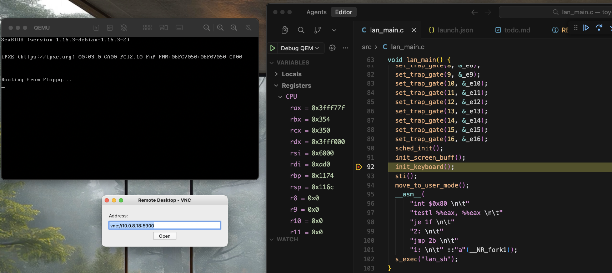
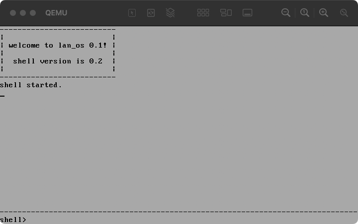

# Toy OS Playground

一个教学型操作系统项目，实现了基本的操作系统功能，包括进程管理、内存管理、系统调用、中断处理等。

## 🎯 项目特性

### 核心功能
- ✅ **Bootloader**：16位实模式启动，加载内核到内存
- ✅ **32位保护模式内核**：完整的模式切换实现
- ✅ **进程管理**：支持 `fork()`、`exec()`、`exit()` 系统调用
- ✅ **内存管理**：简单的分页机制、写时复制（COW）
- ✅ **系统调用**：通过 `int 0x80` 实现内核/用户态切换
- ✅ **中断处理**：定时器、键盘、异常处理
- ✅ **用户态程序**：Shell、ls、loop 等用户程序

### 开发特性
- 🛠 **VS Code 集成调试**：完整的 GDB 调试配置
- 📊 **符号映射文件**：自动生成 `lan_os.map` 符号表
- 🖥 **VNC 显示**：图形化查看运行效果
- 🔧 **自动化构建**：Make + 任务自动化

## 📁 项目结构

```
toy-os-playground/
├── src/                      # 源代码目录
│   ├── boot.s               # Bootloader（16位实模式）
│   ├── head.s               # 内核启动代码（保护模式）
│   ├── lan_main.c           # 内核主函数
│   ├── sched.c/h            # 进程调度
│   ├── mm.c/h               # 内存管理
│   ├── sys_call.c           # 系统调用实现
│   ├── fork.c               # fork 实现
│   ├── keyboard.c           # 键盘驱动
│   ├── print_str.c          # 屏幕输出
│   ├── intel_err_handle.c   # 异常处理
│   ├── common/              # 公共库
│   │   ├── header/          # 头文件
│   │   └── lib/             # 用户态库
│   ├── bin/                 # 用户程序
│   │   ├── shell/           # Shell 程序
│   │   ├── ls/              # 列出文件
│   │   ├── loop/            # 循环测试
│   │   └── test/            # 测试程序
│   ├── root_fs/             # 根文件系统
│   └── fs_patch_tool/       # 文件系统打包工具
├── doc/                      # 文档
│   ├── launch_config_guide.md  # 调试配置指南
│   └── qemu_dbg.md          # QEMU 调试命令
├── .vscode/                  # VS Code 配置
│   ├── launch.json          # GDB 调试配置
│   └── tasks.json           # 构建任务配置
├── Makefile                  # 顶层 Makefile
└── start_qemu_vnc_dbg.sh    # QEMU 启动脚本

```

## 🚀 快速开始

### 环境要求

```bash
# 必需工具
sudo apt install gcc make nasm qemu-system-x86 gdb-multiarch nodejs

# VS Code 扩展（调试用）
- C/C++ (ms-vscode.cpptools)
```

### 构建项目

```bash
# 完整构建（清理 + 编译）
make clean && make

# 只编译内核
make -C src

# 只编译用户程序
make -C src bins
```

### 运行系统

#### 方法 1：直接运行（无调试）
```bash
./start_qemu_vnc.sh
# 使用 VNC 客户端连接 localhost:5900
```

#### 方法 2：调试运行（推荐）

* 在 VS Code 中按 F5
    * 自动清理/编译
    * 自动启动qemu
    * 自动连接gdb
    * 需要手动连接vnc 密码为 0

调试截图

运行截图



## 🔧 开发工作流

### 1. 修改代码
编辑 `src/` 下的源文件

### 2. 构建
```bash
make  # 自动执行 clean + build
```

### 3. 调试
在 VS Code 中：
- 按 **F5** 启动调试（自动构建 + 启动 QEMU + 连接 GDB）
- 按 **Shift+F5** 停止调试（自动清理 QEMU 进程）

### 4. 设置断点
```bash
# 在 Debug Console 中
-exec b *0x7c00          # 地址断点
-exec b check_a20_valid  # 符号断点
-exec info breakpoints   # 查看断点
```

## 📚 技术细节

### Bootloader (boot.s)
- 从 BIOS 加载到 `0x7c00`
- 读取内核到 `0x10000`
- 切换到保护模式
- 跳转到内核入口

### 内核启动 (head.s)
- 设置 GDT、IDT
- 初始化分页
- 初始化 8259A 中断控制器
- 设置定时器、键盘中断
- 跳转到 C 代码 (`lan_main`)

### 系统调用
```c
// 内核态定义
int _sys_fork() { ... }

// 用户态调用
#define _syscall0(type, name) ...
int s_fork(void) {
    __asm__("int $0x80");
}
```

### 进程切换
```
fork() → 复制进程 → 写时复制（COW）
exec() → 加载新程序 → 覆盖地址空间
调度器 → 定时器中断 → switch_to()
```

### 内存管理
- 简单的分页机制（4KB 页）
- 写时复制（Copy-on-Write）
- 每个进程独立的页表

## 🐛 调试技巧

### 查看内核符号
```bash
cat src/lan_os.map | grep function_name
```

### GDB 常用命令
```bash
-exec info registers      # 查看寄存器
-exec x/16xb 0x7c00      # 查看内存
-exec disas              # 反汇编当前函数
-exec bt                 # 查看调用栈
-exec c                  # 继续运行
-exec si                 # 单步执行（指令级）
```

### 查看进程状态
内核提供了简单的调试输出，可以在屏幕上看到进程切换信息。

## 📖 文档

- [调试配置指南](doc/launch_config_guide.md) - 详细的 GDB 调试配置说明
- [QEMU 调试命令](doc/qemu_dbg.md) - QEMU 和 GDB 命令参考
- [源码注释](src/) - 代码中有详细注释

## 🎓 学习路径

### 1. Bootloader 阶段
- 阅读 `src/boot.s`
- 理解实模式到保护模式的切换
- 调试：`-exec b *0x7c00`

### 2. 内核初始化
- 阅读 `src/head.s` 和 `src/lan_main.c`
- 理解 GDT、IDT 设置
- 理解中断处理机制

### 3. 系统调用
- 阅读 `src/sys_call.c`
- 理解 `int 0x80` 机制
- 跟踪 `fork()` 实现

### 4. 进程管理
- 阅读 `src/sched.c` 和 `src/fork.c`
- 理解进程结构和切换
- 理解写时复制（COW）

### 5. 用户程序
- 阅读 `src/bin/shell/lan_main.c`
- 理解用户态/内核态切换
- 编写自己的用户程序

## 🔍 常见问题

### Q: 为什么用户程序需要 `dd skip=8`？
A: 跳过 ELF 头部（4096字节），因为 OS 不解析 ELF 格式，直接加载纯代码。详见代码注释。

### Q: 如何添加新的系统调用？
A: 
1. 在 `src/sys_call.c` 添加实现
2. 在 `sys_call_table` 添加入口
3. 在用户库中添加封装

### Q: 如何添加新的用户程序？
A: 
1. 在 `src/bin/` 创建新目录
2. 参考 `ls/` 的 makefile
3. 在 `src/makefile` 的 `BIN_DIRS` 添加目录名

## 🤝 贡献

这是一个教学项目，欢迎：
- 报告 Bug
- 提出改进建议
- 添加文档
- 分享学习心得

## 📝 License

教学用途，仅供学习参考。

## 🙏 致谢

项目灵感来自 Linux 0.11 和《操作系统真象还原》等经典教材。

---

**Happy Hacking! 🚀**
